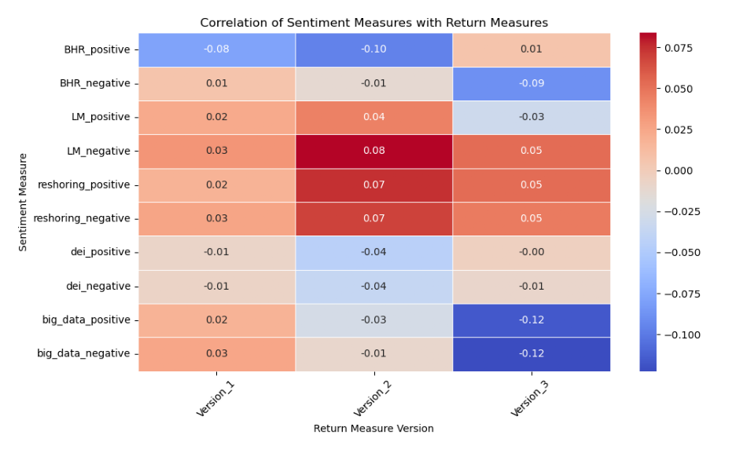
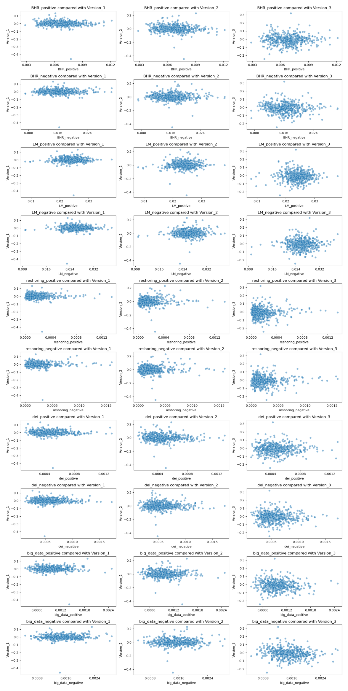
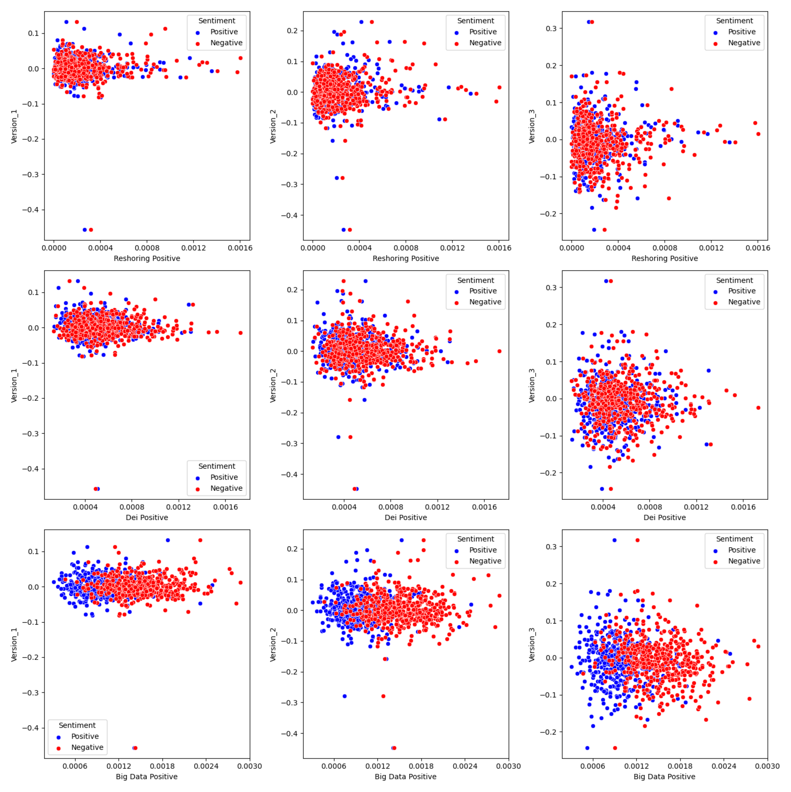

# Midterm One Report File


```python
from PIL import Image
import matplotlib.image as mpimg
import fnmatch
import glob
import os
import re
from time import sleep
from zipfile import ZipFile
import csv
from requests_html import HTMLSession
import requests
import matplotlib.pyplot as plt
import matplotlib.ticker as ticker
import seaborn as sns

import numpy as np
import pandas as pd
from bs4 import BeautifulSoup
from NEAR_regex import NEAR_regex  # copy this file into the folder this script is in
from tqdm import tqdm 

folder_name = "output"
file_name = "graphing_data.csv"
file_path = os.path.join(folder_name, file_name)
graphing = pd.read_csv(file_path)
```

##### Alexander Weissman
##### 21/03/24
##### FIN 377
##### Proffessor Bowen

## Part One: Executive Summary

This model was built for the purpose of testing if an overall sentiment could be ascertained from a form 10-K and attempting to find a link between this calculated sentiment and returns posted of the next few days. This question assumes that the markets are efficient and will react to new information quickly and correctly. This study was done using the S&P 500 in 2022 and used the return figures from 2022 along with the 10-K reports of every company in the S&P 500. I tested for overall positive or negative sentiment using text datasets from the following sources:
- Diego Garcíaa, Xiaowen Hu, and  Maximilian Rohrer’s The Colour of Finance Words 
- Tim Loughran and Bill Mcdonald’s When is a Liability not a Liability? Textual Analysis, Dictionaries, and 10-Ks.

Unfortunately, my testing gave little actual insight that might lead to above market returns. My three topics yielded little useful information. For reshoring, there are companies that have a lot of positive sentiment around the idea of bringing back manufacturing jobs to the Unites states, shown by many outliers. However, there are equally as many outliers that have negative sentiment around reshoring. What can be ascertained is that if a firm talks about reshoring in any light, they outperform those who don’t talk about it at all. DEI had no useful results, just that there are very few companies that would put It in a negative way. There are outliers, again on both sides of the coin that have high sentiment and high returns. Big data also yeilded little useful knowlege. A final and important note is that the actual difference in performance is so negligible, that they could never be used to make stock calls and profit. They could however take an interesting look into the psyche of investors and figure out what matters to them.

## Part Two: Data Selection

### Sample we used
The sample we used is the S&P500 in 2022, and the CRSP returns for that year.

The S&P500 dataset, labeled sp500 in the code has several values in it, such as SEC filings, GICS Sector, GICS Sub-Industry, Headquarters Location, and Date first added, but the relevant 3 are CIK, which is a value unique to every company, Symbol, which is the stocks ticker, and security, which is the name of the company. In the code the stocks accession-number, a unique value for each 10-k filling, is added to access the 10-k’s in the code. The code also adds a filing date to this data frame, to allow for returns to be calculated. This is scraped from the SEC’s website.

The returns are for every company in the US, for every day of the year with a date value and a company name. I merged this dataset with sp500, but only with the company name ans CIK. I did this for 2 reasons. The first reason being that I didn’t need every company traded in the US, only the S&P500 companies. Second, I wanted to use CIK as the identifier for everything in the code, so I needed to add it to the data frame.

### How I build the return variables
After unzipping the CRSP file, I built the return variables in an unorthodox way. I first created a brand-new pandas data frame called reset_returns. I called it this because I first set the CIK to be the index, but I wanted to change it. I then created a dictionary called next_ten_day_returns. I created a dictionary because I wanted it to be a list of lists. I then created a for loop that iterated through the reset_returns date frame with the following logic:

Go through the returns data frame’s date for a specific CIK and if you find a date that matches the filing date create a list of the current and next 10 daily returns. If there are less than ten fill the missing days with zero.

I then created a data frame from the dictionary. This made finding the cumulative returns easy, it was just pulling the dates from the data and then using .cumprod()

### How I built my Sentiment 
The first step to building my sentiment variables was downloading and cleaning the positive and negative words. Each set had to be in lowercase list form. After that I came up with my topics. Coming up with 20+ words wasn’t easy, but with the thesaurus it was doable. I made sure the all the lists were lowercase and put in the regex format. After that I added new columns to hold my sentiment variables these where simple sentiment_q_x (x being 1-10) to make adding values to the columns easier. Using the code that was given I went through every 10-K HTML file and did the near regex analysis on it. The analysis included doing a count of every word in the document and finding the regex value of each list. I then divided the regex value by the document length. I then renamed the columns to make them easier to read.

### Length of each sentiment analysis 
- Length of BHR_negative: 2355
- Length of BHR_positive: 354
- Length of LM_positive: 75
- Length of LM_negative: 94
#### How I set up near_regex
for questions 5-10 I set My range to 70. I did that because I thought it was big enough to capture all words related to the sentiment I was looking for, but small enough to not double count anything. I decided to leave partial as false. I wanted my words to convey the meaning I was going for. and some of the words could be added onto and mean something totally different. So, I added more words to the list and decided partial should stay on.

### Why I chose my 3 topics
Using these datasets I also tested each 10-k’s sentiment around 3 topics. I decided the most relevant topics where re nationalizing manufacturing, diversity equity and inclusion, and the adoption of big data and newer innovations related to big data. I chose these variables because I thought they represented trends in the business world that could have a tangible impact on a company’s performance. Every day it feels as if the world slips farther from the global vision the world held in the 90’s with populism on the rise. Diversity is America’s reality, and I thought that companies that do it better might have an edge. Big data is not a new phenomenon, but it is an interesting aspect of business. Data used for data’s sake can spell disaster for any venture, and I thought perhaps this might prove to display the inverse of what common logic might state, data is always good for a business.

### summary stats


```python
graphing_data.describe()
```


<div>
<style scoped>
    .dataframe tbody tr th:only-of-type {
        vertical-align: middle;
    }

    .dataframe tbody tr th {
        vertical-align: top;
    }

    .dataframe thead th {
        text-align: right;
    }
</style>
<table border="1" class="dataframe">
  <thead>
    <tr style="text-align: right;">
      <th></th>
      <th>CIK</th>
      <th>BHR_positive</th>
      <th>BHR_negative</th>
      <th>LM_positive</th>
      <th>LM_negative</th>
      <th>reshoring_positive</th>
      <th>reshoring_negative</th>
      <th>dei_positive</th>
      <th>dei_negative</th>
      <th>big_data_positive</th>
      <th>big_data_negative</th>
      <th>Version_1</th>
      <th>Version_2</th>
      <th>Version_3</th>
    </tr>
  </thead>
  <tbody>
    <tr>
      <th>count</th>
      <td>4.920000e+02</td>
      <td>492.000000</td>
      <td>492.000000</td>
      <td>492.000000</td>
      <td>492.000000</td>
      <td>492.000000</td>
      <td>492.000000</td>
      <td>492.000000</td>
      <td>492.000000</td>
      <td>492.000000</td>
      <td>492.000000</td>
      <td>492.000000</td>
      <td>492.000000</td>
      <td>492.000000</td>
    </tr>
    <tr>
      <th>mean</th>
      <td>7.896569e+05</td>
      <td>0.006781</td>
      <td>0.016406</td>
      <td>0.023956</td>
      <td>0.025908</td>
      <td>0.000188</td>
      <td>0.000254</td>
      <td>0.000480</td>
      <td>0.000574</td>
      <td>0.000973</td>
      <td>0.001511</td>
      <td>0.001269</td>
      <td>0.003438</td>
      <td>-0.007688</td>
    </tr>
    <tr>
      <th>std</th>
      <td>5.538250e+05</td>
      <td>0.001458</td>
      <td>0.003650</td>
      <td>0.003505</td>
      <td>0.003395</td>
      <td>0.000175</td>
      <td>0.000232</td>
      <td>0.000187</td>
      <td>0.000237</td>
      <td>0.000303</td>
      <td>0.000387</td>
      <td>0.033573</td>
      <td>0.052123</td>
      <td>0.059543</td>
    </tr>
    <tr>
      <th>min</th>
      <td>1.800000e+03</td>
      <td>0.002858</td>
      <td>0.007073</td>
      <td>0.007966</td>
      <td>0.008953</td>
      <td>0.000000</td>
      <td>0.000000</td>
      <td>0.000135</td>
      <td>0.000132</td>
      <td>0.000307</td>
      <td>0.000468</td>
      <td>-0.456763</td>
      <td>-0.447499</td>
      <td>-0.242924</td>
    </tr>
    <tr>
      <th>25%</th>
      <td>9.740950e+04</td>
      <td>0.005695</td>
      <td>0.014019</td>
      <td>0.021896</td>
      <td>0.023977</td>
      <td>0.000070</td>
      <td>0.000106</td>
      <td>0.000346</td>
      <td>0.000401</td>
      <td>0.000763</td>
      <td>0.001243</td>
      <td>-0.014500</td>
      <td>-0.025323</td>
      <td>-0.040731</td>
    </tr>
    <tr>
      <th>50%</th>
      <td>8.840640e+05</td>
      <td>0.006757</td>
      <td>0.016154</td>
      <td>0.024122</td>
      <td>0.025897</td>
      <td>0.000141</td>
      <td>0.000183</td>
      <td>0.000453</td>
      <td>0.000530</td>
      <td>0.000938</td>
      <td>0.001484</td>
      <td>-0.000842</td>
      <td>0.000627</td>
      <td>-0.007415</td>
    </tr>
    <tr>
      <th>75%</th>
      <td>1.137113e+06</td>
      <td>0.007694</td>
      <td>0.018310</td>
      <td>0.026142</td>
      <td>0.027813</td>
      <td>0.000249</td>
      <td>0.000321</td>
      <td>0.000580</td>
      <td>0.000691</td>
      <td>0.001130</td>
      <td>0.001770</td>
      <td>0.017220</td>
      <td>0.028560</td>
      <td>0.025704</td>
    </tr>
    <tr>
      <th>max</th>
      <td>1.868275e+06</td>
      <td>0.012126</td>
      <td>0.030649</td>
      <td>0.037982</td>
      <td>0.038030</td>
      <td>0.001356</td>
      <td>0.001603</td>
      <td>0.001305</td>
      <td>0.001727</td>
      <td>0.002482</td>
      <td>0.002872</td>
      <td>0.132710</td>
      <td>0.229167</td>
      <td>0.317860</td>
    </tr>
  </tbody>
</table>
</div>


reason that all of these return characteristics could happen for every company. The sentiment values are also in line with what I might expect given how specific my categories are and how large the document is. The returns and sentiment both seem in line. It is also important to note that 2022 was an exceptionally volatile year for US equities, and also the S&P 500 lost 18% during the year. This explains why the mean 10-day return is negative and the other returns are so low.

### Smell Test
After describing all the variables in the final 'graphing' data frame, nothing looks out of the ordinary. There is not a crazy minimum or maximum value, all values seem to make sense. There is as much variation as I would expect given the dataset. I decided to analyze the tech sector because in 2022 the tech sector got hit hard. However, I found that the mean loss for 10 days returns as actually better than the market average. I did some digging and found that tech companies did the worst in august and most of their 10-k's were filed before or after the summer.

### Caveats About the Sample
There are some important things that any user should know about the data. In the process of cleaning and refining the data, statistics on 7 companies are lost. This comes from missing values that might arise from a delisting, or a company being taken private. It is also important to remember that I chose the words for my 3 topics. I am not a professional researcher, nor do I claim to be. There is certainly a better basket of words out there to analyze the sentiment I am looking for. Finally, this data is taken from 2022, an unusually volatile market. In 2022 the VIX, a proxy for market volatility, spent 91% of its days trading above $20.0. you must go back to 2009 to find similarly high levels of volatility. That may lead to the return figures being overstated or understated compared to how the market would usually react.

## Part Three: Results

### Correlation Table


```python
image_path = "output/correlation_heatmap.png"

# Load and display the image
img = mpimg.imread(image_path)
plt.figure(figsize=(12, 10))
plt.imshow(img)
plt.axis('off')  # Hide axis
plt.show()
```


    

    


### Scatter Plots


```python
image_path = "output/subplots_seaborn.png"

# Load and display the image
img = mpimg.imread(image_path)
plt.figure(figsize=(40, 30))
plt.imshow(img)
plt.axis('off')  # Hide axis
plt.show()
```


    

    


#### Topic One:


```python
image_path = "output/topic_1.png"

# Load and display the image
img = mpimg.imread(image_path)
plt.figure(figsize=(40, 30))
plt.imshow(img)
plt.axis('off')  # Hide axis
plt.show()
```


    

    


The relationship between the LM variables seems to be non-predictive. The negative and positive values cluster together and don't seem to indicate any relationship. There is a zero or near zero correlation for these variables. The same can be said for the BHR. The only difference there is that there is higher sentiment for negative words compared to positive words. This makes sense as there are over 2000 negative sentiment words, and less than 400 positive words. BHR also seems to not be predictive. ideally the higher the negative sentiment, the lower the returns should be, but in reality, that it’s just not the case. The regression line would be close to zero.

#### Topic Two:

Our patterns agree far more than they disagree, in the sense that the return is insignificant. They had an R squared of .013 - .014 for their returns which is as close as non-predictive as you can get. My data is also incredibly non predictive. I think they included more firms for multiple reasons. The first being they probably had substantially more time to do their paper and the most likely had to hit some minimum sample size for the academic paper. Finance is a unique industry where in bad investment related information is disastrous not just for the finance professional, but also his clients directly. This calls for a high degree of certainty when making any calls about predictive models. This leads to a high degree of certainty being required and having 80000 firms provides that. They needed to be thorough. Finance is also unique in that opportunity to beat the market is fleeting. There may be times and sectors where this strategy could work, and excluding those times could lead to missed discoveries.

#### Topic Three:


```python
image_path = "output/topic_2.png"

# Load and display the image
img = mpimg.imread(image_path)
plt.figure(figsize=(40, 30))
plt.imshow(img)
plt.axis('off')  # Hide axis
plt.show()
```


    

    


Upon conducting an extensive analysis encompassing three distinct topics—reshoring, diversity, equity, and inclusion (DEI), and big data—it becomes evident that none of these avenues yielded particularly promising or actionable insights. I will break down the rationale for why I thought each would be indicative and why they might not be.

##### Reshoring
Following the shock that covid-19 provided to the world’s supply chain, and the continued problems herein, I predicted that companies who brought their production back the United States might face different returns. This topic yielded the most interesting results of any of my topics, especially at the outliers. Not higher returns, but different. Manufacturing in America is expensive and bringing back US production might be the wrong move. This probably wasn't predictive because this is a topic that is talked about more in investor meetings rather than 10-K’s.

##### DEI
This was the lease useful of all of my topics. It provided no real insight to company performance. The scatter charts look almost identical to the LM returns, which had an r squared of .014 in their report. I think this is because DEI has become such a popular thing that every company is talking about it. This doesn't allow for any differentiation and thus probably no above market returns.

##### Big Data
Big data suffers from many of the same problems as DEI, that being that it is an old fad. Big data came onto the mainstream in the 2010's and now is slightly played out. Perhaps my analysis would have been better if I focused on artificial intelligence rather than data as its the new big thing in Silicon Valley. This doesn't have predicative power because its old news.

#### Topic Four:

Because the data is so unpredictive, there is no significant difference in sign. There is a difference in magnitude, especially as the date goes further from t+0. I believe this has to do with the volatility the market was facing in 2022. As previously stated, the VIX hasn't moved as much since 2022. I also think the topics affected the magnitude of variation. if the topics where older trends, like DEI and big data, then there is probably less variation on how each company is handling it, especially compared to newer trends like AI, populism, and quantum computing.
