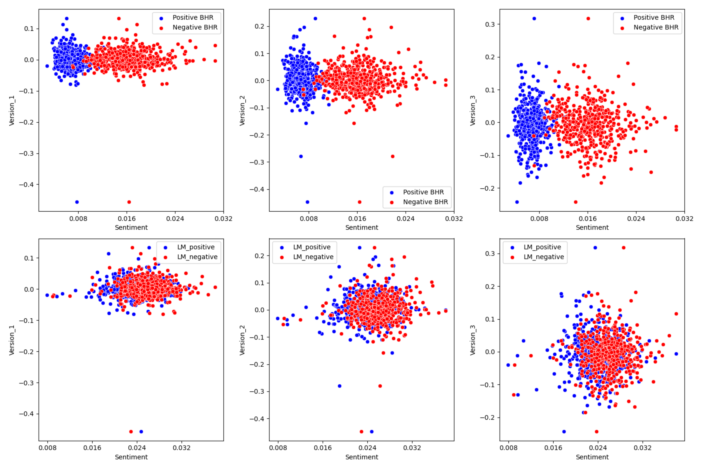

## About Me

My name is Alexander Weissman, I am a senior at Lehigh Studying Finance and Economics. This past Summer I took and passed CFA level 1, and am planning to take level 2 November of this year. I served 1 term as IFC President, and was nominated for 4 different awards for my work in that capacity, and won two of them.

<!-- Upload your own photo and change the path -->

  

 

---

## Portfolio

<!-- You can link to other websites, PDFs in this repo, and other pages in this repo -->

_**[Natural language processing 10-Ks to Look for excess returns](Report.md)**_

I found what I might expect to find in a natural language processing of 10-K data, which is to say not much. Credit to Fama French, as the efficient market hypothesis destroys any opportunity for above-market returns with such a simple approach.

_**[Do members of Congress play the stock market? And, more importantly, do they win?](https://donbowen.github.io/teamproject/)**_

---

_**[Report on why the JetBlue merger wouldn't go through in cotober 2022](JBlue.md)**_

---

## Career Objectives
My goal is to work as an equity research analyst. I am interested because the position offers a flatter organizational structure, fostering an entrepreneurial spirit that allows for creativity and innovation. I am driven by the desire to become an expert in a field, and the in-depth analysis required in equity research presents an ideal opportunity for this pursuit. Moreover, I believe that immersing myself in the rigorous process of analyzing stocks within a dynamic market environment is the most effective way to develop invaluable analytical skills and gain practical insights into investment strategies.

---

## Hobbies

In my free time I love to read. I used to read as a kid, and recently I've picked up the habbit again, with the goal to read 20 books this year. My favorite genre is non fiction, with a focus on history and the financial sector. I also play soccer when I can, and have recently gotten really into tennis. The next sport I want to get better at is golf, but needless to say I am a long way from being what I would consider a "good golfer"

---

Page template forked from <a href="https://github.com/evanca/quick-portfolio">evanca</a>

<!-- Remove above link if you don't want to attibute -->
