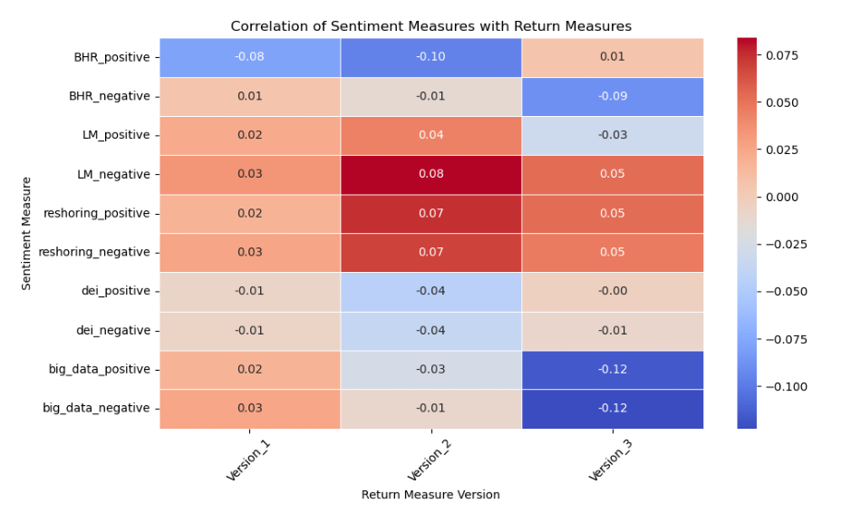

## About Me

My name is Alexander Weissman, I am a senior at Lehigh Studying Finance and Economics. This past Summer I took and passed CFA level 1, and am planning to take level 2 November of this year. I served 1 term as IFC President, and was nominated for 4 different awards for my work in that capacity, and won two of them.

<!-- Upload your own photo and change the path -->

  

 

---

## Portfolio

<!-- You can link to other websites, PDFs in this repo, and other pages in this repo -->

_**[Natural language processing 10-Ks to Look for excess returns](Report.md)**_

I found what I might expect to find in a natural language processing of 10-K data, which is to say not much. Credit to Fama French, as the efficient market hypothesis destroys any opportunity for above-market returns with such a simple approach.

_**[Eventual team project](https://donbowen.github.io/teamproject/)**_

---

_**[Some personal project](/pdf/sample_presentation.pdf)**_

---

## Career Objectives
I would like to work on an equity research team at a bank. 

---

## Hobbies

Maybe include a little about these, especially if they are the kinds of things that work well in interviews.

---

Page template forked from <a href="https://github.com/evanca/quick-portfolio">evanca</a>

<!-- Remove above link if you don't want to attibute -->
